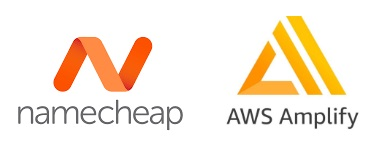
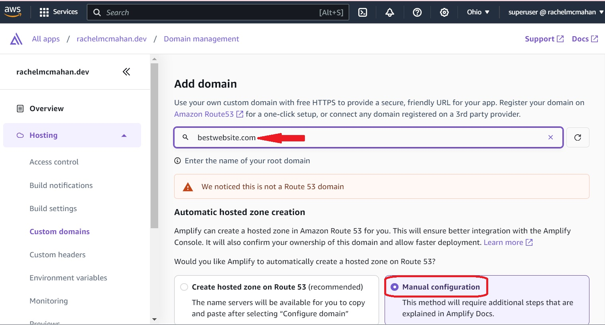
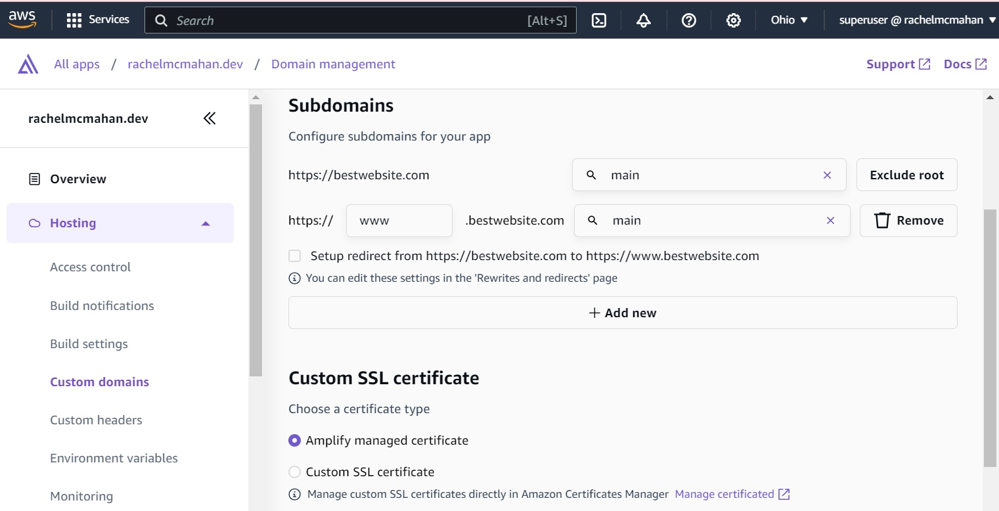
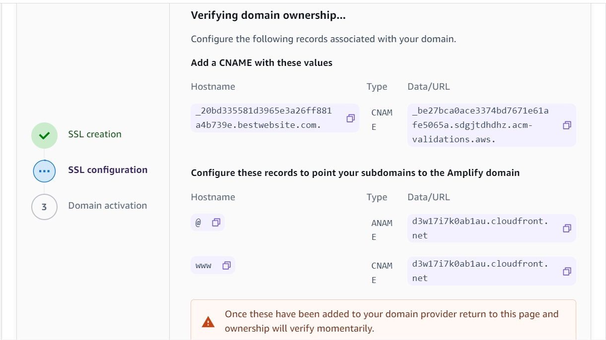
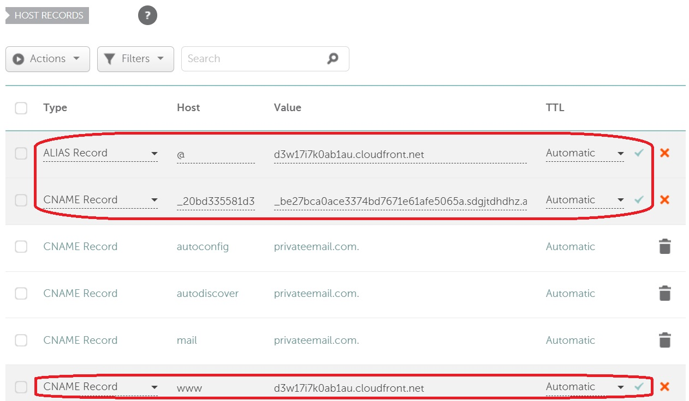

So you've already bought bestwebsite.com at Namecheap. Now you have an app hosted on AWS Amplify, but it gave you a horrendous URL like https://main.dfgj363qb7xti.amplifyapp.com. Listen up, here's what we're going to do. By following this guide, you'll be able to hook up your beautiful, custom Namecheap domain to AWS Amplify.

Go to your app in AWS Amplify and select "Hosting" > "Custom domains" from the lefthand menu. Click the "Add domain" button.

Type bestwebsite.com or whatever domain you got up in that box up top. Give it a few seconds to think about some stuff.

Free tier alert! Under "Automatic hosted zone creation", select "Manual configuration" because if you select the "Create hosted zone on Route 53" option, you'll get charged for the hosted zone.

At the bottom, click "Configure domain".

On the Subdomains page, make sure it has two entries for your domain. One with and without www. Below, accept the default of "Amplify managed certificate" which will create a free SSL/TLS certificate for your website in AWS Certificate Manager.

Give this baby a few minutes to assemble some widgets. In the meantime, take note of the records it tells you to set up for your domain because we're going to come back to these in a minute.

Now we're going to head over and log in to namecheap.com. In the upper-right, click Account > Domain List. In the list, click the Manage button next to your domain. Then click the Advanced DNS tab.

Under HOST RECORDS, you need to click + ADD NEW RECORD and you're going to add 3 records in total. The Type should be CNAME for 2 of them and Alias for 1 of them.

Back in Amplify, you noted there are two CNAME and one ANAME Records. The Hostname goes into the Namecheap Host. The Data/URL goes into the Namecheap Value. The ANAME Record is the Namecheap Type of ALIAS Record. Click the green checkmark once you're done entering each DNS record to save it.

Now this might be quick or it might take a day or two before you can access your Amplify website at your custom domain. The first time I did this it took about a day before I could stop using the hideously long Amplify URL and use my custom domain instead. That's all there is to it!
